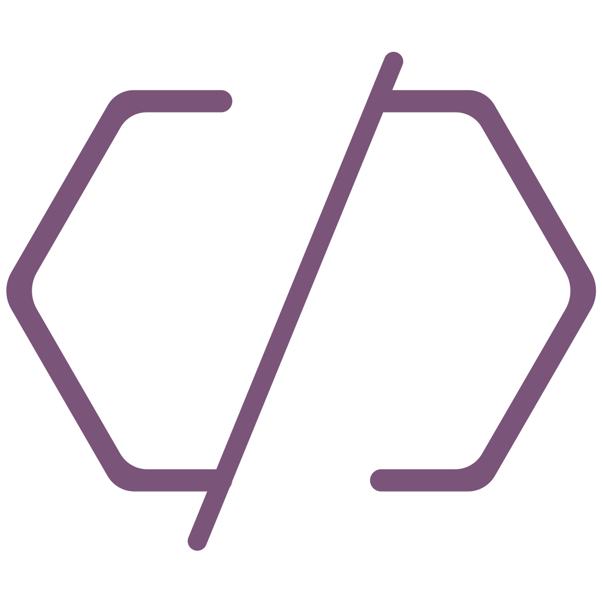

<a id="readme-top">

</a>

<br />
<div align="center">
  

  <h3 align="center">✨ my cool little corner of the web ✨</h3>

</div>

<details>
  <summary>what's inside this box?</summary>
  <ol>
  <li>
    <a href="#the-what--why">the what & why</a>
    <ul>
    <li><a href="#tech-toys-i-played-with">tech toys i played with</a></li>
    </ul>
  </li>
  <li>
    <a href="#how-to-kick-things-off">how to kick things off</a>
    <ul>
    <li><a href="#development-setup">development setup</a></li>
    <li><a href="#installation">installation</a></li>
    </ul>
  </li>
  <li><a href="#contributing">contributing</a></li>
  <li><a href="#license">boring legal stuff</a></li>
  <li><a href="#contact">say hi to me!</a></li>

  </ol>
</details>

## the what & why

this is my personal portfolio website where I showcase my projects, share my
technical expertise, and document my professional journey. it serves as a
comprehensive digital presence that highlights my skills and experience in
modern web development.

key features:

- responsive design optimized for all devices 📱💻
- project portfolio showcasing live applications 🚀
- technical blog with development insights 💭

built with modern web technologies to ensure optimal performance and user
experience. regularly updated with new projects and technical content.

feel free to explore and reach out for collaboration opportunities or technical
discussions!

### tech toys i played with

this project is built with the following technologies and frameworks:

[![Next.js][Next-badge]][Next-url] [![React][React-badge]][React-url]
[![TypeScript][TypeScript-badge]][TypeScript-url]
[![Tailwind CSS][Tailwind-badge]][Tailwind-url]
[![Framer Motion][Framer-badge]][Framer-url] [![MDX][MDX-badge]][MDX-url]
[![React Email][ReactEmail-badge]][ReactEmail-url]
[![React Icons][ReactIcons-badge]][ReactIcons-url]
[![Resend][Resend-badge]][Resend-url] [![Zod][Zod-badge]][Zod-url]
[![Prisma][Prisma-badge]][Prisma-url] [![MongoDB][MongoDB-badge]][MongoDB-url]

## how to kick things off

to run this project locally, follow the installation and setup instructions
below:

### development setup

before getting started, ensure you have the following installed:

- pnpm (the fast, disk space efficient package manager)
  ```sh
  npm install -g pnpm
  ```
- node.js (version 18.17.0 or higher)
  ```sh
  nvm install 18.17.0 # recommended via nvm
  ```
  or download from [nodejs.org](https://nodejs.org/en/download/)

### installation

_follow these steps to set up a local development environment:_

1. clone the repository

```sh
git clone https://github.com/frer0t/site.git
```

2. navigate to the project directory

```sh
cd site
```

3. install dependencies

```sh
pnpm install
```

4. create environment variables file (`.env.local`)

```
NEXT_PUBLIC_URL=http://localhost:3000
RESEND_KEY=your_resend_api_key
RESEND_AUDIENCE_ID=your_audience_id
RESEND_FROM_EMAIL=your@custom.domain
MONKEY_TYPE_KEY=your_monkey_type_api_key
```

5. start the development server

```sh
pnpm dev
```

6. open your browser to [http://localhost:3000](http://localhost:3000) and start
   developing! ✨

the application should now be running locally on your development environment.

<p align="right">(<a href="#readme-top">back to top ⬆️</a>)</p>

## contributing

got cool ideas to make this site even more awesome? i'm all ears! 👂

### brilliant thought brewing?

if your brain is bubbling with improvements or you spotted something wonky:

1. scoot over to the [issues page](https://github.com/frer0t/site/issues)
2. smash that "new issue" button
3. tell me all about your brilliant idea
4. slap on a fancy tag like "enhancement" or "feature"

i love hearing fresh ideas! if your suggestion makes me go "wow!", it might just
become part of the site!

<p align="right">(<a href="#readme-top">back to top ⬆️</a>)</p>

## license

this project is under the mit license - which basically means "do whatever but
don't sue me" 😉 check out the [LICENSE](LICENSE) for the boring details.

<p align="right">(<a href="#readme-top">back to top ⬆️</a>)</p>

## contact

frérot ntwali - [me[at]frerot.dev](mailto:me@frerot.dev)

<p align="right">(<a href="#readme-top">back to top ⬆️</a>)</p>

<!-- ACKNOWLEDGMENTS -->

## acknowledgments

big high-fives to all these amazing resources that helped me build this site:

- [next.js docs](https://nextjs.org/docs) - the superhero framework for react
- [react docs](https://legacy.reactjs.org/docs/getting-started.html) - the OG
  building blocks of modern web
- [typescript handbook](https://www.typescriptlang.org/docs/) - because types
  make life better
- [tailwind css docs](https://tailwindcss.com/docs) - css without the tears
- [framer motion docs](https://www.framer.com/motion/introduction/) - making
  things wiggle and jiggle
- [mdx docs](https://mdxjs.com/docs/) - markdown with superpowers
- [react email docs](https://react.email/docs) - emails that don't look like
  they're from 1999
- [react icons library](https://react-icons.github.io/react-icons/) - pretty
  pictures galore
- [resend docs](https://resend.com/docs) - email delivery that actually works
- [zod docs](https://github.com/colinhacks/zod#documentation) - validating stuff
  like a boss

these tools are the real MVPs! 🏆 couldn't have built this digital fun house
without them!

<p align="right">(<a href="#readme-top">back to top ⬆️</a>)</p>

[Next-badge]:
  https://img.shields.io/badge/Next.js-000000?style=for-the-badge&logo=next.js&logoColor=white
[Next-url]: https://nextjs.org/
[React-badge]:
  https://img.shields.io/badge/React-20232A?style=for-the-badge&logo=react&logoColor=61DAFB
[React-url]: https://reactjs.org/
[TypeScript-badge]:
  https://img.shields.io/badge/TypeScript-007ACC?style=for-the-badge&logo=typescript&logoColor=white
[TypeScript-url]: https://www.typescriptlang.org/
[Tailwind-badge]:
  https://img.shields.io/badge/Tailwind_CSS-38B2AC?style=for-the-badge&logo=tailwind-css&logoColor=white
[Tailwind-url]: https://tailwindcss.com/
[Framer-badge]:
  https://img.shields.io/badge/Framer_Motion-0055FF?style=for-the-badge&logo=framer&logoColor=white
[Framer-url]: https://www.framer.com/motion/
[MDX-badge]:
  https://img.shields.io/badge/MDX-1B1F24?style=for-the-badge&logo=mdx&logoColor=white
[MDX-url]: https://mdxjs.com/
[ReactEmail-badge]:
  https://img.shields.io/badge/React_Email-000000?style=for-the-badge&logo=react&logoColor=61DAFB
[ReactEmail-url]: https://react.email/
[ReactIcons-badge]:
  https://img.shields.io/badge/React_Icons-61DAFB?style=for-the-badge&logo=react&logoColor=black
[ReactIcons-url]: https://react-icons.github.io/react-icons/
[Resend-badge]:
  https://img.shields.io/badge/Resend-000000?style=for-the-badge&logo=resend&logoColor=white
[Resend-url]: https://resend.com/
[Zod-badge]:
  https://img.shields.io/badge/Zod-3068B7?style=for-the-badge&logo=zod&logoColor=white
[Zod-url]: https://github.com/colinhacks/zod
[Prisma-badge]:
  https://img.shields.io/badge/Prisma-2D3748?style=for-the-badge&logo=prisma&logoColor=white
[Prisma-url]: https://www.prisma.io/
[MongoDB-badge]:
  https://img.shields.io/badge/MongoDB-47A248?style=for-the-badge&logo=mongodb&logoColor=white
[MongoDB-url]: https://www.mongodb.com/
