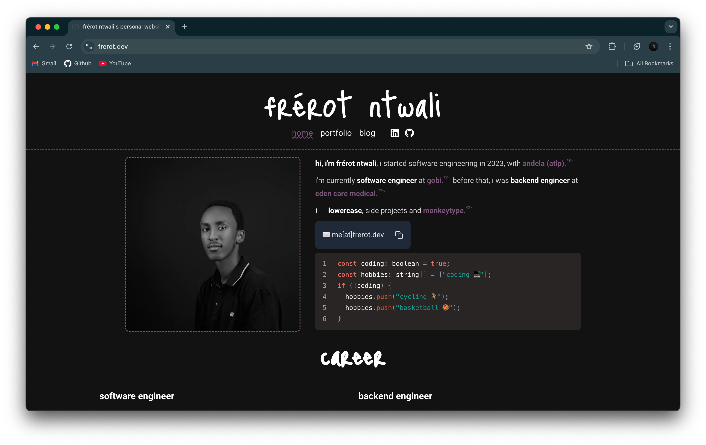

<a id="readme-top">

</a>

<br />
<div align="center">
  

  <h3 align="center">✨ my cool little corner of the web ✨</h3>

</div>

<details>
  <summary>what's inside this box?</summary>
  <ol>
  <li>
    <a href="#about-the-project">the what & why</a>
    <ul>
    <li><a href="#built-with">tech toys i played with</a></li>
    </ul>
  </li>
  <li>
    <a href="#getting-started">how to kick things off</a>
    <ul>
    <li><a href="#prerequisites">stuff you'll need first</a></li>
    <li><a href="#installation">setting up the fun</a></li>
    </ul>
  </li>
  <li><a href="#usage">how to use this thing</a></li>
  <li><a href="#roadmap">future adventures</a></li>
  <li><a href="#license">boring legal stuff</a></li>
  <li><a href="#contact">say hi to me!</a></li>

  </ol>
</details>

## the what & why

[](https://frerot.dev) hey there! this is my
digital playground where i show off cool stuff i've made, talk about what i
know, and share my professional journey. think of it as my little home on the
internet where you can learn all about me and my work!

some neat features:

- super sleek design that looks awesome on any screen size 📱💻
- a showcase of my digital creations in the wild 🚀
- random thoughts and tech ramblings in blog 💭

i built this with all the modern web goodies to make sure it's zippy fast and
smooth as butter. i pop in regularly to add my latest projects and brain dumps!

come explore and don't be shy - drop me a line if you want to chat or
collaborate on something cool!

### tech toys i played with

here are the fun tools i used to build this digital treehouse:

[![Next.js][Next-badge]][Next-url] [![React][React-badge]][React-url]
[![TypeScript][TypeScript-badge]][TypeScript-url]
[![Tailwind CSS][Tailwind-badge]][Tailwind-url]
[![Framer Motion][Framer-badge]][Framer-url] [![MDX][MDX-badge]][MDX-url]
[![React Email][ReactEmail-badge]][ReactEmail-url]
[![React Icons][ReactIcons-badge]][ReactIcons-url]
[![Resend][Resend-badge]][Resend-url] [![Zod][Zod-badge]][Zod-url]
[![Prisma][Prisma-badge]][Prisma-url] [![MongoDB][MongoDB-badge]][MongoDB-url]

## how to kick things off

want to run this site on your own computer? follow these steps and you'll be up
and running in no time! 🏃‍♂️💨

### stuff you'll need first

before we dive in, make sure you've got these things installed:

- npm (the package wrangler)
  ```sh
  npm install npm@latest -g
  ```
- node (either using nvm - the cool way)
  ```sh
  nvm install 18.17.0 # or whatever version floats your boat
  ```
  or grab it from [nodejs.org](https://nodejs.org/en/download/) like a normal
  person

### setting up the fun

_follow these magical incantations to summon a local version of my website:_

1. snag a copy of my code

```sh
git clone https://github.com/iamfrerot/site.git
```

2. jump into the project folder

```sh
cd site
```

3. install all the digital ingredients

```sh
npm install
# or if you're fancy
yarn install
# or if you're extra fancy
pnpm install
```

4. create a secret spell book (`.env.local`) with these magic words

```
NEXT_PUBLIC_URL=http://localhost:3000
RESEND_KEY=your_resend_api_key
RESEND_AUDIENCE_ID=your_audience_id
RESEND_FROM_EMAIL=my@custom.domain
```

5. start the engines!

```sh
npm run dev
# or
yarn dev
# or
pnpm dev
```

6. point your browser to [http://localhost:3000](http://localhost:3000) and
   voilà! ✨

congrats! you've got my website running on your very own computer. how cool is
that?

<p align="right">(<a href="#readme-top">back to top ⬆️</a>)</p>
s
## contributing

got cool ideas to make this site even more awesome? i'm all ears! 👂

### brilliant thought brewing?

if your brain is bubbling with improvements or you spotted something wonky:

1. scoot over to the [issues page](https://github.com/iamfrerot/site/issues)
2. smash that "new issue" button
3. tell me all about your brilliant idea
4. slap on a fancy tag like "enhancement" or "feature"

i love hearing fresh ideas! if your suggestion makes me go "wow!", it might just
become part of the site!

<p align="right">(<a href="#readme-top">back to top ⬆️</a>)</p>

## license

this project is under the mit license - which basically means "do whatever but
don't sue me" 😉 check out the [LICENSE](LICENSE) for the boring details.

<p align="right">(<a href="#readme-top">back to top ⬆️</a>)</p>

## contact

frérot ntwali - [me[at]frerot.dev](mailto:me@frerot.dev)

<p align="right">(<a href="#readme-top">back to top ⬆️</a>)</p>

<!-- ACKNOWLEDGMENTS -->

## acknowledgments

big high-fives to all these amazing resources that helped me build this site:

- [next.js docs](https://nextjs.org/docs) - the superhero framework for react
- [react docs](https://legacy.reactjs.org/docs/getting-started.html) - the OG
  building blocks of modern web
- [typescript handbook](https://www.typescriptlang.org/docs/) - because types
  make life better
- [tailwind css docs](https://tailwindcss.com/docs) - css without the tears
- [framer motion docs](https://www.framer.com/motion/introduction/) - making
  things wiggle and jiggle
- [mdx docs](https://mdxjs.com/docs/) - markdown with superpowers
- [react email docs](https://react.email/docs) - emails that don't look like
  they're from 1999
- [react icons library](https://react-icons.github.io/react-icons/) - pretty
  pictures galore
- [resend docs](https://resend.com/docs) - email delivery that actually works
- [zod docs](https://github.com/colinhacks/zod#documentation) - validating stuff
  like a boss

these tools are the real MVPs! 🏆 couldn't have built this digital fun house
without them!

<p align="right">(<a href="#readme-top">back to top ⬆️</a>)</p>

[Next-badge]:
  https://img.shields.io/badge/Next.js-000000?style=for-the-badge&logo=next.js&logoColor=white
[Next-url]: https://nextjs.org/
[React-badge]:
  https://img.shields.io/badge/React-20232A?style=for-the-badge&logo=react&logoColor=61DAFB
[React-url]: https://reactjs.org/
[TypeScript-badge]:
  https://img.shields.io/badge/TypeScript-007ACC?style=for-the-badge&logo=typescript&logoColor=white
[TypeScript-url]: https://www.typescriptlang.org/
[Tailwind-badge]:
  https://img.shields.io/badge/Tailwind_CSS-38B2AC?style=for-the-badge&logo=tailwind-css&logoColor=white
[Tailwind-url]: https://tailwindcss.com/
[Framer-badge]:
  https://img.shields.io/badge/Framer_Motion-0055FF?style=for-the-badge&logo=framer&logoColor=white
[Framer-url]: https://www.framer.com/motion/
[MDX-badge]:
  https://img.shields.io/badge/MDX-1B1F24?style=for-the-badge&logo=mdx&logoColor=white
[MDX-url]: https://mdxjs.com/
[ReactEmail-badge]:
  https://img.shields.io/badge/React_Email-000000?style=for-the-badge&logo=react&logoColor=61DAFB
[ReactEmail-url]: https://react.email/
[ReactIcons-badge]:
  https://img.shields.io/badge/React_Icons-61DAFB?style=for-the-badge&logo=react&logoColor=black
[ReactIcons-url]: https://react-icons.github.io/react-icons/
[Resend-badge]:
  https://img.shields.io/badge/Resend-000000?style=for-the-badge&logo=resend&logoColor=white
[Resend-url]: https://resend.com/
[Zod-badge]:
  https://img.shields.io/badge/Zod-3068B7?style=for-the-badge&logo=zod&logoColor=white
[Zod-url]: https://github.com/colinhacks/zod
[Prisma-badge]:
  https://img.shields.io/badge/Prisma-2D3748?style=for-the-badge&logo=prisma&logoColor=white
[Prisma-url]: https://www.prisma.io/
[MongoDB-badge]:
  https://img.shields.io/badge/MongoDB-47A248?style=for-the-badge&logo=mongodb&logoColor=white
[MongoDB-url]: https://www.mongodb.com/
